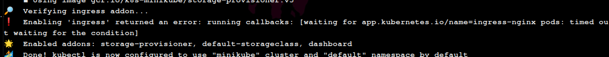
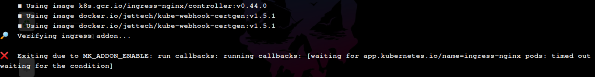

# How to fix ingress-nginx timeout error (minikube)

**_NOTE: this uses minikube_**

## Error

This is the log on running `minikube start --vm=true`.



And this is the log error while running `minikube addons enable ingress`



## Solution

1. Run,

   ```bash
   minikube start --vm=true
   ```

2. then run,

   ```bash
   kubectl -n kube-system edit deployment ingress-nginx-controller
   ```

3. and it might ask you to enter to continue.
4. then look for "image:". and change it to,

   ```vim
   image: us.gcr.io/k8s-artifacts-prod/ingress-nginx/controller@sha256:0e072dddd1f7f8fc8909a2ca6f65e76c5f0d2fcfb8be47935ae3457e8bbceb20
   ```

5. Save the file (make sure to remove the comments, if there, from the top of the file). If you dont know how to save file in vim the type `:w + enter` and `:q + enter` to quite vim.
6. stop the minikube server by running,

   ```bash
   minikube stop
   ```

7. once it stops, re-run the minikube start with this command,

   ```bash
   minikube start --addons=ingress --alsologtostderr -v=5
   ```

## Versions info

- Minikube - v1.22.0.
- Kubernetes - v1.21.0

Thanks any doubts. please raise a issue ✌️.
